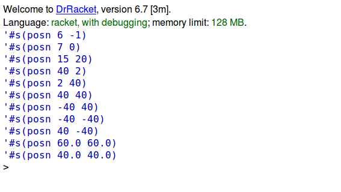

## My Library: Positions
My name: Andrew Long
http://docs.racket-lang.org/posn/index.html

I used the Positions racket library as the library for the first exploration. It is a library that helps with plotting points and performing some basic operations on coordinates, like addition, scaling, and rotating around the origin and other points. This library can be seen as an extended version of the PS2b assignment. A pair of coordinates can be created, but this library has formulas that perform calculations on coordinates.  To test this library out, I called some functions that perform coordinate addition, scaling, multiplication and rotating. 

```
#lang racket
(require posn)

(posn-add (posn 1 2) (posn 5 -3))
(posn-add (posn-add (posn 1 2) (posn 5 -3)) (posn 1 1))

(posn-multiply (posn 3 4) (posn 5 5))

(posn-scale-x 20 (posn 2 2))
(posn-scale-y 20 (posn 2 2))

(posn-rotate-origin-ccw-90 (posn 40 40))

(posn-rotate-ccw (posn 40 40) 180 (posn 20 20))
```
The code outputs the result of the calculations.
* (posn-add (posn 1 2) (posn 5 -3)) = (6, -1)
* (posn-add (posn-add (posn 1 2) (posn 5 -3)) (posn 1 1)) = (7, 0)
* (posn-multiply (posn 3 4) (posn 5 5)) = (15, 20)
* (posn-scale-x 20 (posn 2 2)) = (40, 2)
* (posn-scale-y 20 (posn 2 2)) = (2, 40)
* (posn-rotate-origin-ccw-90 (posn 40 40)) = (-40, 40)
* (posn-rotate-ccw (posn 40 40) 180 (posn 20 20)) = (60, 60)


